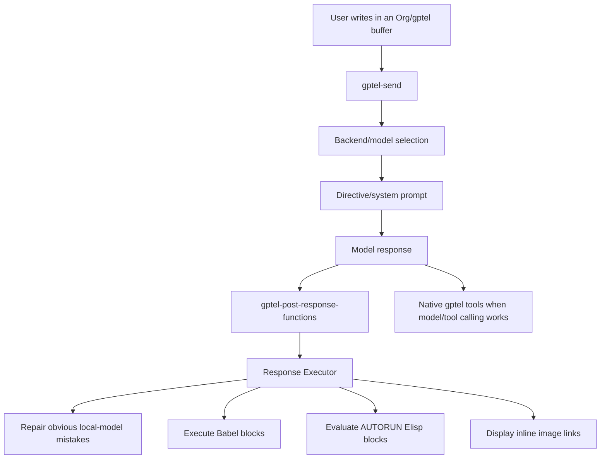
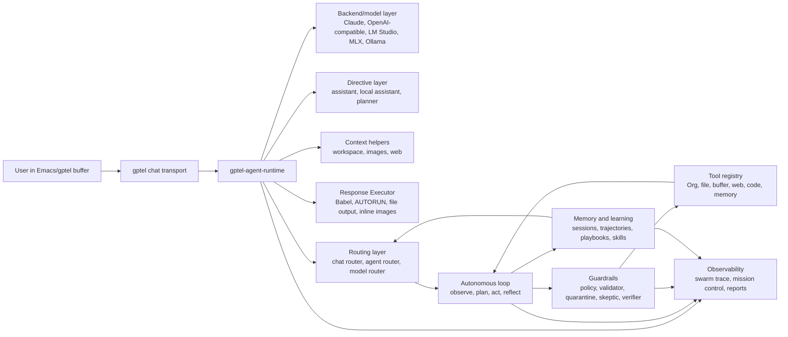
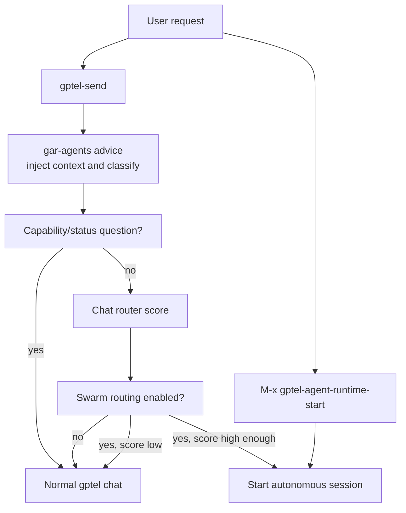
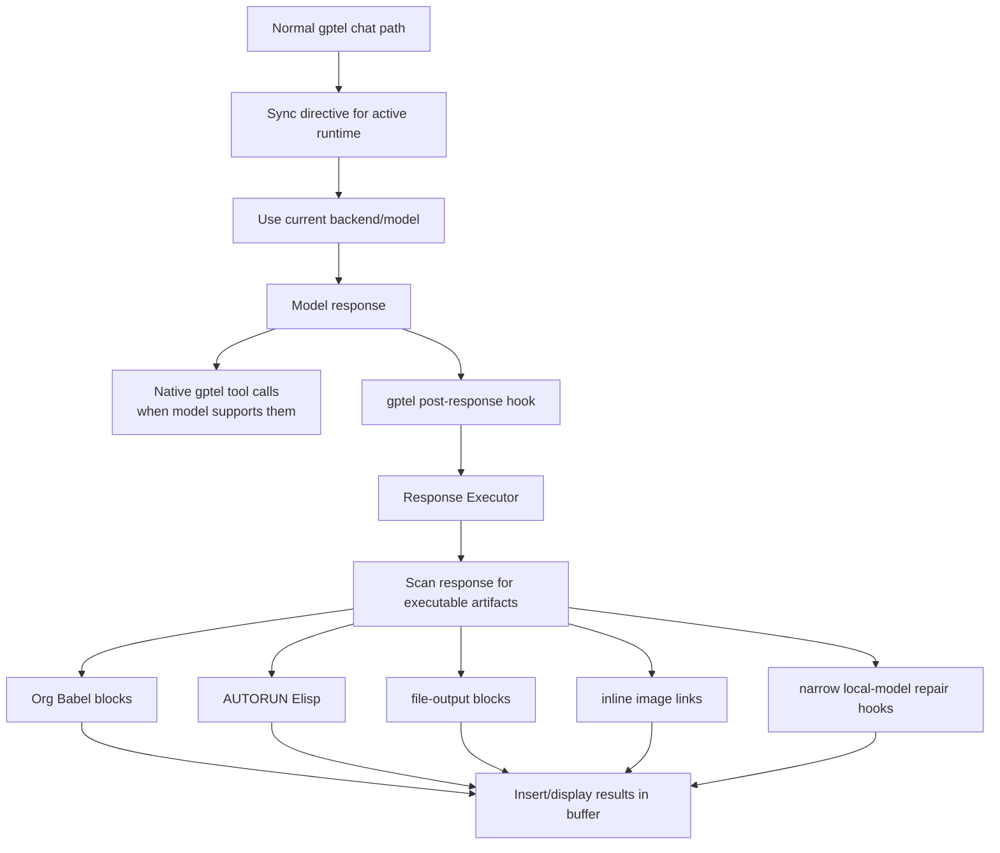
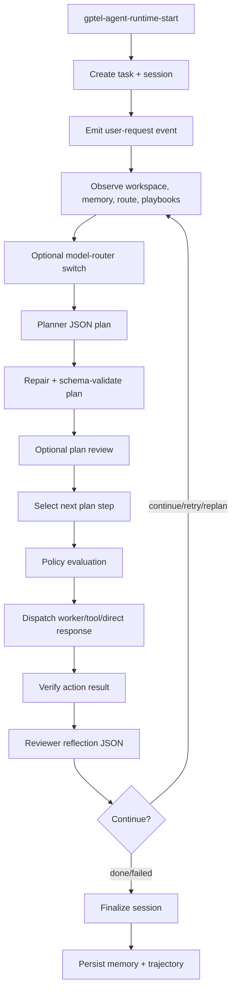
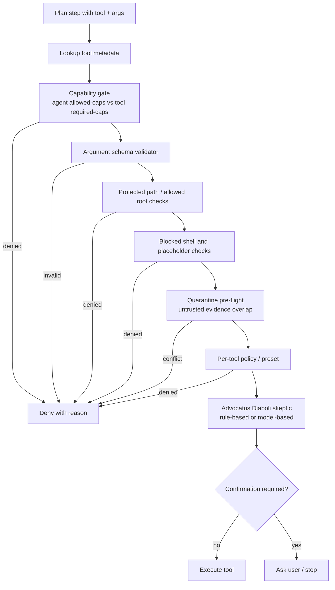
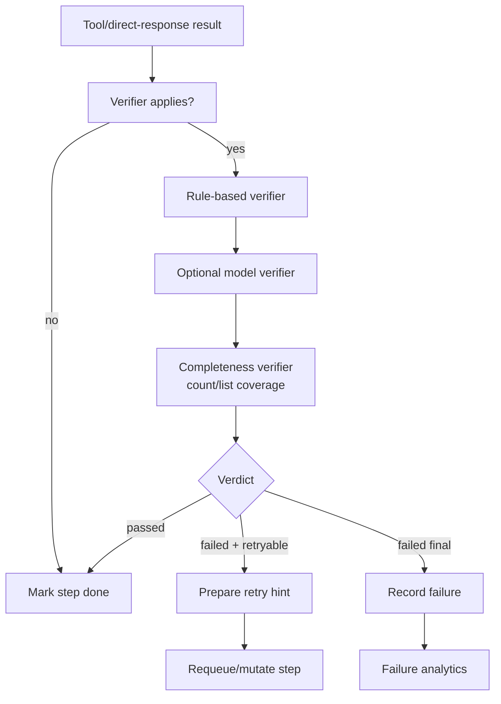
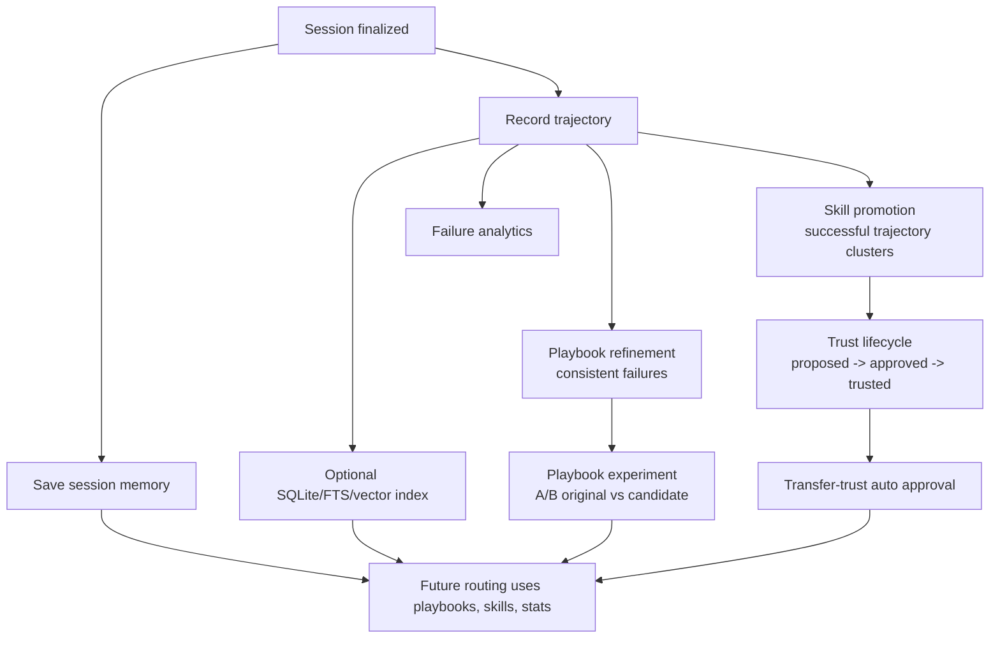
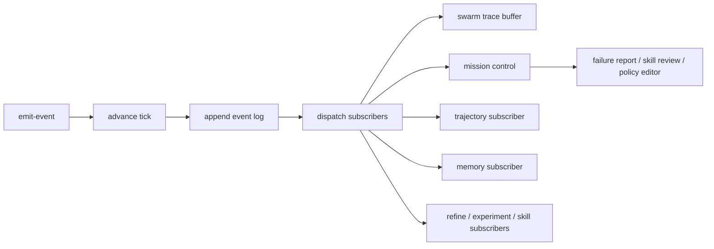

# Emacs gptel Agent Architecture

This document explains the AI/gptel implementation after the split into the
standalone `gptel-agent-runtime` package. It is meant to make the architecture
understandable before changing more code.

For the complete list of user-settable runtime options, including the knobs for
chat routing, learning, skill promotion, guardrails, model routing, and storage,
see [Runtime Options](options.md).

## Repository Roles

- `~/emacs` is the live private Emacs-plus runtime repo. Emacs loads
  `~/emacs/config/config.org`, which loads the split Org config files.
- `~/emacs/config/gptel-setup.org` is now only the package loader.
- `~/gptel-agent-runtime` is the standalone package repo and implementation source.
- `~/emacs/config/gptel-setup.el` is generated by tangling the Org file. Do not
  edit it directly.
- `~/emacs-mac-setup` is the installer/bootstrap/template repo. Use it for
  setup scripts and reusable install defaults, not day-to-day runtime changes.

## Runtime Flow



The key point: gptel is the transport and chat UI. The agent-like behavior now lives in the `gptel-agent-runtime` package, while the private Emacs config only installs and loads it.

## Graphical Flow Overview

The runtime now has several possible paths. The diagrams below show the
important branches: normal chat, response execution, chat-to-swarm routing,
autonomous planning, tool safety, verification, memory/learning, and
observability.

### Whole-System Map



### Entry Points And Branches



### Normal Chat And Response Execution



### Autonomous Session Flow



### Tool Safety Flow



### Verification And Retry Flow



### Memory And Learning Flow



### Event And Observability Flow



## When Each Flow Runs

This section is the "conditions legend" for the diagrams above.

### Package Load

Runs when Emacs loads `gptel-agent-runtime.el`, normally through the private
Emacs setup file or package installation.

Conditions:

- Always requires the modules in the master load order.
- Forwards a pre-bound `my/data-dir` into
  `gptel-agent-runtime-data-directory` when present.
- Activates `gar-response-executor-mode` when that function is available.
- Selects the default local Ollama model only when
  `gptel-agent-runtime-ollama-backend` is already registered.
- Enables global gptel tools after `gptel` itself is loaded.
- Applies `gptel-agent-runtime-chat-router-startup-mode`, whose default is
  `off`; use `ask` or `auto` if chat-to-swarm should be active after startup.

### Normal gptel Chat

Runs when the user calls `gptel-send` and the chat router does not take over.

Conditions:

- Always available when gptel is loaded.
- Workspace context is injected only when
  `gptel-agent-runtime-context-enabled` is non-nil.
- Model-router switching happens only when
  `gptel-agent-runtime-model-router-enabled` is non-nil.
- Native gptel tools run only when the active buffer has `gptel-use-tools`
  enabled and `gptel-tools` is non-empty, and the backend/model actually emits
  tool calls.
- Response Executor post-processing runs only after a model response arrives
  and `gar-response-executor-mode` is active.

Normal chat stays normal when any of these are true:

- `gptel-agent-runtime-enabled` is nil.
- `gptel-agent-runtime-chat-router-enabled` is nil.
- `gptel-agent-runtime-chat-router-mode` is `off`.
- The request is classified as a capability/status question.
- The chat-router score is below `gptel-agent-runtime-chat-router-min-score`.
- Router mode is `ask` and the user declines.

### Response Executor

Runs after a gptel response, not before the model answers.

Conditions:

- `gar-response-executor-mode` must be active.
- It only does work when the response contains recognized executable or
  renderable artifacts.
- Babel execution requires a supported Org Babel language and local executable
  dependencies such as `gnuplot` when that language needs them.
- AUTORUN Elisp runs only for blocks marked in the expected AUTORUN shape and
  allowed by the executor's safety settings.
- File-output and inline-image behavior requires a block/link that names an
  output file.
- Repair hooks are narrow compatibility paths for known local-model mistakes;
  they do not make arbitrary prose executable.

### Chat-To-Swarm Routing

Runs inside the gptel-send advice before ordinary chat is sent.

Conditions:

- `gptel-agent-runtime-enabled` must be non-nil.
- `gptel-agent-runtime-chat-router-enabled` must be non-nil.
- `gptel-agent-runtime-chat-router-mode` must be `auto` or `ask`.
- The latest request text must not be a capability/status question.
- The chat-router score must meet or exceed
  `gptel-agent-runtime-chat-router-min-score`.
- In `auto` mode the runtime starts an autonomous session immediately.
- In `ask` mode the runtime asks before starting.
- In `off` mode or below threshold, the request remains normal gptel chat.

The router score rises for prompts that look like implementation work,
research, multi-step workflow, file/org changes, planning, review, or tool-heavy
tasks.

### Manual Autonomous Session

Runs when the user explicitly calls `M-x gptel-agent-runtime-start`.

Conditions:

- Does not require chat-router activation.
- Uses the provided goal, role, and process if supplied.
- Falls back to `gptel-agent-runtime-default-role` and
  `gptel-agent-runtime-default-process`.
- Stops after a terminal state or after `gptel-agent-runtime-max-iterations`.

### Autonomous Planning

Runs at the start of an autonomous session and again whenever reflection asks
to continue, retry, or replan.

Conditions:

- Workspace observation is always attempted, but details depend on available
  buffers/files.
- Similar trajectory context is included only when the relevant planner
  trajectory settings are enabled and there is matching history.
- Recent handover context is included only when
  `gptel-agent-runtime-planner-handover-enabled` is non-nil and trajectories
  exist.
- Matching playbooks are included only when playbook routing finds matches.
- Model routing inside the session can switch backends only when matching
  profiles exist in `gptel-agent-runtime-backends`.
- Plan review runs only when `gptel-agent-runtime-enable-plan-review` is
  non-nil and the plan risk meets `gptel-agent-runtime-plan-review-risk-threshold`.

### Worker And Parallel Execution

Runs after a plan exists and the loop selects executable steps.

Conditions:

- A step can run only after policy allows it or the user confirms it.
- Parallel worker dispatch requires `gptel-agent-runtime-enable-parallel-workers`.
- Safe/read tools are eligible when their tool names are in
  `gptel-agent-runtime-parallel-safe-tool-names`.
- Mutating tools are eligible for parallel execution only when
  `gptel-agent-runtime-enable-parallel-mutations` is non-nil, the tool is in
  `gptel-agent-runtime-parallel-mutation-tool-names`, policy allows it, and
  target paths do not conflict.
- Concurrency is capped by `gptel-agent-runtime-max-parallel-workers`.
- Failed/cancelled workers can be retried up to
  `gptel-agent-runtime-worker-max-retries`.

### Tool Safety

Runs before every autonomous tool/action step.

Conditions:

- Capability enforcement runs when
  `gptel-agent-runtime-capability-enforcement-enabled` is non-nil.
- Tool argument schema validation runs when the tool has an `:arg-schema`.
- Protected path and allowed write-root checks run for steps with path-like
  arguments.
- Blocked shell and placeholder checks run for command/code-like arguments.
- Quarantine pre-flight runs only when
  `gptel-agent-runtime-quarantine-pre-flight-enabled` is non-nil.
- Per-tool policy applies when `gptel-agent-runtime-policy-enabled` is non-nil.
- The skeptic runs only for allowed steps whose risk/capabilities match
  `gptel-agent-runtime-skeptic-trigger-risks` or
  `gptel-agent-runtime-skeptic-trigger-caps`, and only when
  `gptel-agent-runtime-skeptic-enabled` is non-nil.
- Confirmation is requested when the policy/risk decision requires it, or when
  a high-risk skeptic verdict escalates the decision.

### Verification And Retry

Runs after a tool/action result is observed.

Conditions:

- Primary verification runs according to `gptel-agent-runtime-verifier-mode`.
  `off` disables it, `rule-based` uses deterministic checks, and model modes
  can ask a verifier model.
- Verification applies only to risks listed in
  `gptel-agent-runtime-verifier-trigger-risks`.
- Completeness verification is separate and runs only when
  `gptel-agent-runtime-verifier-completeness-mode` is not `off`, the tool is in
  `gptel-agent-runtime-verifier-completeness-trigger-tools`, and prior tool
  output contains enough items to compare against.
- Retry preparation happens only when the verdict failed, has a correction, and
  the step has not exceeded `gptel-agent-runtime-verifier-max-retries`.
- Final failures are recorded for failure analytics and future refinement.

### Memory And Trajectories

Runs when sessions are saved, finalized, resumed, or used as planner context.

Conditions:

- Session state is written during loop progress and finalization.
- Trajectory recording runs on session finalization.
- SQLite indexing runs only when `gptel-agent-runtime-sqlite-enabled` is
  non-nil and SQLite support is available.
- Embedding retrieval runs only when
  `gptel-agent-runtime-memory-retrieval-method` is `ollama-embeddings` and the
  embedding model is reachable; otherwise lexical retrieval is used.
- Embedding cache writes happen only when
  `gptel-agent-runtime-embedding-cache-enabled` is non-nil.

### Learning Features

These flows are subscribers: they react to finalized sessions or recorded
trajectories.

Conditions:

- Playbook refinement runs automatically only when
  `gptel-agent-runtime-refine-mode` is `auto`, the playbook has at least
  `gptel-agent-runtime-refine-min-runs`, the recent failure rate is at least
  `gptel-agent-runtime-refine-failure-threshold`, and cooldown allows it.
- Playbook experiments run only after an experiment is started with
  `gptel-agent-runtime-experiment-start`; auto-decision requires
  `gptel-agent-runtime-experiment-auto-decide` and enough samples for the
  selected decision rule.
- Skill promotion runs according to `gptel-agent-runtime-skill-promote-mode`.
  It needs enough similar successful trajectories, no active cooldown, and a
  cluster similarity above `gptel-agent-runtime-skill-promote-similarity-threshold`.
- Trust bypass applies only after a skill reaches the configured trust
  threshold.
- Transfer-trust auto approval applies only when transfer trust is enabled and
  enough trusted similar skills match the candidate.
- Failure analytics updates when verifier verdicts or failed trajectories
  exist; reports are visible on demand and in mission control.

### Event Pump And Observability

Runs whenever code calls `gptel-agent-runtime-emit-event`.

Conditions:

- Every non-tick event advances the monotonic tick counter.
- Event log writes happen only when `gptel-agent-runtime-event-log-enabled` is
  non-nil; write failures are ignored when
  `gptel-agent-runtime-event-log-ignore-write-errors` is non-nil.
- Swarm trace updates when live trace display is enabled.
- Mission control is visible only when opened, but it reads the latest state
  produced by events, verifier/skeptic results, canaries, experiments, skill
  promotion, and failure analytics.
- Idle-pump ticks occur only when `gptel-agent-runtime-idle-pump-enabled` is
  non-nil and the idle timer has been started.

## Main Components

### Backend and Model Layer

Defined in the package's `Multi-Backend Configuration` section.

Current backends include:

- Claude / Anthropic
- OpenAI-compatible ChatGPT endpoint
- LM Studio
- MLX
- Ollama

For Ollama, the config:

- starts the Ollama server if configured and needed
- checks `/api/ps` for an already-loaded model
- prefers the active Ollama model if one is running
- falls back to `qwen2.5-coder:7b`

This means if `ollama run qwen2.5-coder:7b` is already running, gptel should
select that model automatically after restart/load.

### Directive Layer

Defined in the package's `GPtel Directives` section.

Important directives:

- `assistant`: short generic assistant directive
- `emacs-local-assistant`: model-neutral local directive for Qwen/Ollama-style
  models
- `emacs-planner`: planner-only directive for autonomous sessions
- `emacs-assistant`: longer full assistant directive

The local directive is intentionally explicit because smaller local models often
ignore long, abstract instructions. It tells the model to return executable Org
content instead of tutorial instructions.

### Tool Layer

Defined in the package's `AI Tools` section.

Tools are registered through gptel and include:

- Org tools for TODO creation and agenda-like behavior
- file tools
- buffer tools
- export tools
- web search/fetch/image helpers
- code execution helpers

Expected tool status in a working local session:

- `gptel-use-tools = t`
- `gptel-tools` is non-empty
- web tools include `web_search` and `web_fetch_text`

Use `C-c G S` to inspect active backend, model, directive, and tool counts.

### Response Executor

Defined in `Response Executor`.

This is the part that makes "inline output" possible. It watches model responses
through `gptel-post-response-functions` and can:

- execute Org Babel blocks
- execute `:AUTORUN` Elisp blocks
- execute file-output blocks such as `gnuplot :file graph3d.png`
- call `org-display-inline-images`
- repair some obvious local-model mistakes

For inline plots to work, the model response must contain something like:

```org
$f(x,y)=\sin(\sqrt{x^2+y^2})$

#+begin_src gnuplot :file graph3d.png
set terminal pngcairo size 1200,900 enhanced font "Arial,12"
set samples 160
set isosamples 160
set hidden3d
set pm3d at s depthorder
set xlabel "x"
set ylabel "y"
set zlabel "f(x,y)"
splot [-8:8][-8:8] sin(sqrt(x*x+y*y)) with pm3d
#+end_src

#+RESULTS:
[[file:graph3d.png]]
```

If the model instead says "open M-x gnuplot" or "make sure gnuplot is
installed", there is nothing for Org to execute. A narrow repair hook now tries
to catch that specific mistake, but this is still a workaround, not a complete
agent runtime.

### Web Helpers

Defined in `Web & Image Helpers for AI Models`.

These provide Emacs-side search/fetch functions and gptel tools so local models
can search the web indirectly. Local models do not have internet access by
themselves; Emacs must expose web lookup as a tool or executable Elisp block.

### Workspace Context

Defined in `Workspace Context`.

This collects project/buffer/git context and can inject it into model requests.
It is a first step toward better context management but is not yet a full
adaptive attention/memory system.

### Agents And Skills

Defined in `Agent and Skill Registry`.

The package now has explicit registries for agents and skills. Agents are
specialist roles such as `assistant`, `planner`, `executor`, `reviewer`, and
`memory-curator`. Skills are reusable strategies such as `inline-rendering`,
`web-research`, `org-task-management`, `code-change`, and `memory-update`.

Before `gptel-send`, the runtime inspects recent buffer text, matches skills,
selects an agent, and appends relevant skill instructions to the active system
message. This gives direct chat requests a route decision and skill context.
The autonomous loop also uses the same registry to delegate each planned step to
an agent role.

Useful inspection entry points:

- `gptel-agent-runtime-route-task`
- `gptel-agent-runtime-route-summary`
- `gptel-agent-runtime-describe-route`

### Planner Loop

Defined in `Planner Loop`.

This is the first working autonomous-agent loop:

1. create a session
2. observe the active Emacs/workspace context
3. route the goal through the agent/skill registry
4. ask the planner for strict JSON plan steps
5. delegate each step to an agent role or safe/read parallel worker
6. act with `direct_response`, `remember`, or a native gptel tool and JSON args
7. observe, verify, and store the action result
8. ask the reviewer for strict JSON reflection
9. remember resumable session state and skill outcomes on disk
10. continue, replan, finish, or fail

The interactive entry point is `M-x gptel-agent-runtime-start`. Status can be
inspected with `gptel-agent-runtime-session-summary` or
`M-x gptel-agent-runtime-describe-session`.

The planner can mark safe/read steps as parallel. Those steps run as worker
records with worker state stored in the session. Direct responses run as
separate gptel requests; safe/read native tools such as file reads, buffer
reads, Org inspection, and web search/fetch can also run as workers. Mutating
tools can run as parallel workers only when mutation parallelism is enabled,
confirmation policy permits it, the safety layer accepts the step, and selected
worker target paths do not conflict. Native async gptel tools are supported
when they use gptel's callback-first tool function convention.

Before planning, the runtime retrieves relevant prior session memory. Retrieval
defaults to lexical scoring and can optionally use Ollama embeddings when
`gptel-agent-runtime-memory-retrieval-method` is set to `ollama-embeddings` and
the configured embedding model is available. Embeddings are persisted in
`embedding-cache.el` when `gptel-agent-runtime-embedding-cache-enabled` is
non-nil.

Session memory is readable Elisp data and can now be reconstructed into runtime
structs. Use `M-x gptel-agent-runtime-resume-last-session` or
`M-x gptel-agent-runtime-resume-session` to continue unfinished work after an
Emacs restart. Running workers from a saved session are requeued into draft
steps because in-flight HTTP requests cannot literally survive a process
restart.

After execution, the runtime records skill success/failure statistics and uses
those stats as a small adjustment in future routing. Planner and reviewer JSON
is repaired and schema-validated before the runtime acts on it. The schema path
uses an external `check-jsonschema`-style command when configured and available,
then falls back to internal validation.

This is useful and executable, but it is not yet as robust as Claude Code. The
loop still depends on local-model planning quality, parallel mutation requires
explicit safety policy, and verification is still rule-based rather than a
complete task-specific test framework.

## Why It Still Fails Sometimes

The current implementation combines prompts, tools, hooks, and repair code. That
can make local Qwen feel more agentic, but it does not guarantee tool-grade
behavior.

Common failure modes:

- the model answers conversationally instead of emitting executable Org
- the model writes a source block without `:file`
- the model gives manual instructions instead of doing the task
- the model says it cannot browse even though Emacs has web tools
- gptel tools are enabled globally but not active in the current buffer
- a generated block exists but Org Babel cannot execute it because a local
  dependency such as `gnuplot` is missing
- the response executor hook is not loaded because Emacs was not restarted or
  the generated `.el` was not reloaded after tangling

## Current Gap To A Real Agent Runtime

The current system is "chat plus Emacs-side execution scaffolding." The desired
target is a real agent runtime.

Missing or incomplete pieces:

- stronger structured tool-call enforcement for local models
- richer JSON Schema integration with an Elisp library when one is added
- more reliable tool argument generation
- persistent embedding cache pruning and richer semantic memory scoring
- stronger conflict handling for resumed tasks
- worker cancellation and progress UI
- richer skill outcome learning and strategy selection
- broader task-specific automatic verification after tool execution
- adaptive retry strategy
- stricter safe command policy and risk classification
- model-specific compatibility adapters
- package extraction into a clean MELPA-ready module

## Practical Debug Checklist

When behavior seems wrong:

1. Restart Emacs after package changes, or load the tangled
   `~/gptel-agent-runtime/gptel-agent-runtime.el` for a quick smoke test.
2. Run `C-c G S`.
3. Confirm the model is the expected Ollama/Qwen model.
4. Confirm directive is `emacs-local-assistant`.
5. Confirm `use-tools=t`.
6. Confirm `tools` and `web-tools` are non-zero.
7. For inline plots, confirm the response contains a `gnuplot :file` block.
8. Confirm `gnuplot` exists on the system if graph execution fails.

## Development Rules

- Edit `~/gptel-agent-runtime/gptel-agent-runtime.org`, not the generated
  `gptel-agent-runtime.el`.
- Tangle after edits; the `.el` file is the package artifact consumed by
  `package-vc-install`.
- Validate with `check-parens`.
- Run a batch load smoke test before pushing package changes.
- Record meaningful changes in `~/emacs/notes/gptel-handover.md`.
- Keep private runtime work on `~/emacs:main`.
- Use `~/emacs-mac-setup` only for installer/template changes.
