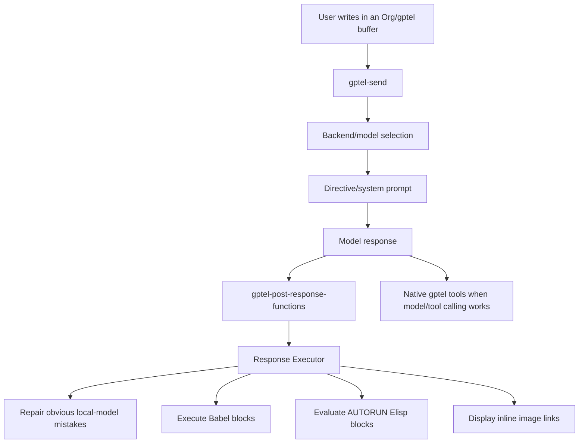

# Emacs gptel Agent Architecture

This document explains the AI/gptel implementation after the split into the
standalone `gptel-agent-runtime` package. It is meant to make the architecture
understandable before changing more code.

## Repository Roles

- `~/emacs` is the live private Emacs-plus runtime repo. Emacs loads
  `~/emacs/config/config.org`, which loads the split Org config files.
- `~/emacs/config/gptel-setup.org` is now only the package loader.
- `~/gptel-agent-runtime` is the standalone package repo and implementation source.
- `~/emacs/config/gptel-setup.el` is generated by tangling the Org file. Do not
  edit it directly.
- `~/emacs-mac-setup` is the installer/bootstrap/template repo. Use it for
  setup scripts and reusable install defaults, not day-to-day runtime changes.

## Runtime Flow



The key point: gptel is the transport and chat UI. The agent-like behavior now lives in the `gptel-agent-runtime` package, while the private Emacs config only installs and loads it.

## Main Components

### Backend and Model Layer

Defined in the package's `Multi-Backend Configuration` section.

Current backends include:

- Claude / Anthropic
- OpenAI-compatible ChatGPT endpoint
- LM Studio
- MLX
- Ollama

For Ollama, the config:

- starts the Ollama server if configured and needed
- checks `/api/ps` for an already-loaded model
- prefers the active Ollama model if one is running
- falls back to `qwen2.5-coder:7b`

This means if `ollama run qwen2.5-coder:7b` is already running, gptel should
select that model automatically after restart/load.

### Directive Layer

Defined in the package's `GPtel Directives` section.

Important directives:

- `assistant`: short generic assistant directive
- `emacs-local-assistant`: model-neutral local directive for Qwen/Ollama-style
  models
- `emacs-planner`: planner-only directive for autonomous sessions
- `emacs-assistant`: longer full assistant directive

The local directive is intentionally explicit because smaller local models often
ignore long, abstract instructions. It tells the model to return executable Org
content instead of tutorial instructions.

### Tool Layer

Defined in the package's `AI Tools` section.

Tools are registered through gptel and include:

- Org tools for TODO creation and agenda-like behavior
- file tools
- buffer tools
- export tools
- web search/fetch/image helpers
- code execution helpers

Expected tool status in a working local session:

- `gptel-use-tools = t`
- `gptel-tools` is non-empty
- web tools include `web_search` and `web_fetch_text`

Use `C-c G S` to inspect active backend, model, directive, and tool counts.

### Response Executor

Defined in `Response Executor`.

This is the part that makes "inline output" possible. It watches model responses
through `gptel-post-response-functions` and can:

- execute Org Babel blocks
- execute `:AUTORUN` Elisp blocks
- execute file-output blocks such as `gnuplot :file graph3d.png`
- call `org-display-inline-images`
- repair some obvious local-model mistakes

For inline plots to work, the model response must contain something like:

```org
$f(x,y)=\sin(\sqrt{x^2+y^2})$

#+begin_src gnuplot :file graph3d.png
set terminal pngcairo size 1200,900 enhanced font "Arial,12"
set samples 160
set isosamples 160
set hidden3d
set pm3d at s depthorder
set xlabel "x"
set ylabel "y"
set zlabel "f(x,y)"
splot [-8:8][-8:8] sin(sqrt(x*x+y*y)) with pm3d
#+end_src

#+RESULTS:
[[file:graph3d.png]]
```

If the model instead says "open M-x gnuplot" or "make sure gnuplot is
installed", there is nothing for Org to execute. A narrow repair hook now tries
to catch that specific mistake, but this is still a workaround, not a complete
agent runtime.

### Web Helpers

Defined in `Web & Image Helpers for AI Models`.

These provide Emacs-side search/fetch functions and gptel tools so local models
can search the web indirectly. Local models do not have internet access by
themselves; Emacs must expose web lookup as a tool or executable Elisp block.

### Workspace Context

Defined in `Workspace Context`.

This collects project/buffer/git context and can inject it into model requests.
It is a first step toward better context management but is not yet a full
adaptive attention/memory system.

### Planner Loop

Defined in `Planner Loop`.

This is an early autonomous-agent loop:

1. create a session
2. ask for a structured plan
3. parse plan steps
4. dispatch a tool or direct response
5. reflect on results
6. finalize or adapt

This is useful groundwork, but it is not yet as robust as Claude Code. The loop
still needs stronger schemas, better error recovery, tool argument generation,
state persistence, and task-specific verification.

## Why It Still Fails Sometimes

The current implementation combines prompts, tools, hooks, and repair code. That
can make local Qwen feel more agentic, but it does not guarantee tool-grade
behavior.

Common failure modes:

- the model answers conversationally instead of emitting executable Org
- the model writes a source block without `:file`
- the model gives manual instructions instead of doing the task
- the model says it cannot browse even though Emacs has web tools
- gptel tools are enabled globally but not active in the current buffer
- a generated block exists but Org Babel cannot execute it because a local
  dependency such as `gnuplot` is missing
- the response executor hook is not loaded because Emacs was not restarted or
  the generated `.el` was not reloaded after tangling

## Current Gap To A Real Agent Runtime

The current system is "chat plus Emacs-side execution scaffolding." The desired
target is a real agent runtime.

Missing or incomplete pieces:

- structured tool-call enforcement for local models
- schema-validated planner output
- reliable tool argument generation
- persistent memory with retrieval and scoring
- task state stored across sessions
- automatic verification after tool execution
- adaptive retry strategy
- safe command policy and risk classification
- model-specific compatibility adapters
- package extraction into a clean MELPA-ready module

## Practical Debug Checklist

When behavior seems wrong:

1. Restart Emacs after package changes, or load the tangled
   `~/gptel-agent-runtime/gptel-agent-runtime.el` for a quick smoke test.
2. Run `C-c G S`.
3. Confirm the model is the expected Ollama/Qwen model.
4. Confirm directive is `emacs-local-assistant`.
5. Confirm `use-tools=t`.
6. Confirm `tools` and `web-tools` are non-zero.
7. For inline plots, confirm the response contains a `gnuplot :file` block.
8. Confirm `gnuplot` exists on the system if graph execution fails.

## Development Rules

- Edit `~/gptel-agent-runtime/gptel-agent-runtime.org`, not the generated
  `gptel-agent-runtime.el`.
- Tangle after edits; the `.el` file is the package artifact consumed by
  `package-vc-install`.
- Validate with `check-parens`.
- Run a batch load smoke test before pushing package changes.
- Record meaningful changes in `~/emacs/notes/gptel-handover.md`.
- Keep private runtime work on `~/emacs:main`.
- Use `~/emacs-mac-setup` only for installer/template changes.
